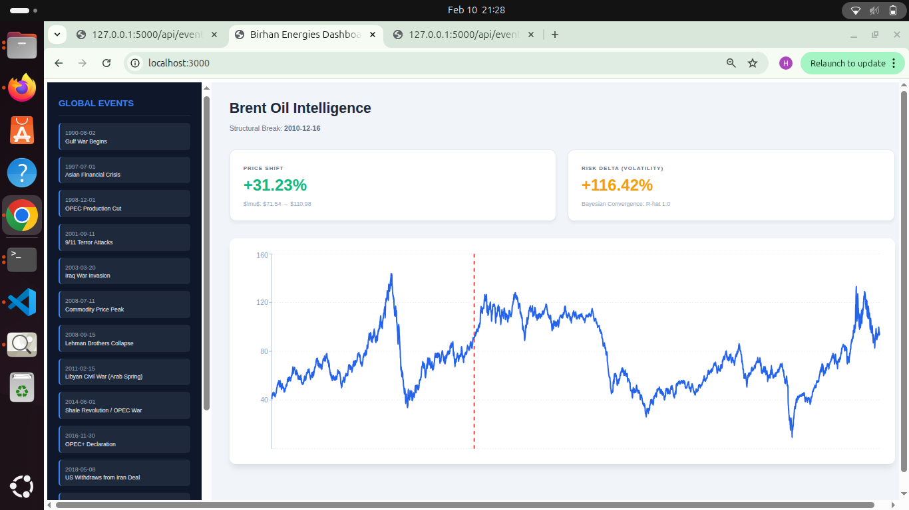

# Brent Oil Change Point Analysis Intelligence Platform
**Birhan Energies | Quantitative Unit**

## 📌 Executive Summary
This platform provides a robust statistical framework for identifying structural breaks in global Brent Oil prices. By combining **Bayesian Inference (PyMC)** with a **Full-stack Interactive Dashboard**, we empower stakeholders to differentiate between market volatility and permanent regime shifts driven by geopolitical shocks.

# 📊 Dashboard Preview

*Figure 1: Interactive Intelligence Dashboard showing the 2010 structural break associated with the Arab Spring.*

## 🛠️ Tech Stack & Rigor
- **Backend:** Flask (Python) with RESTful API architecture.
- **Frontend:** React.js, Recharts, and Axios for real-time visualization.
- **Modeling:** PyMC (Bayesian MCMC), NUTS Sampler, Arviz for convergence diagnostics.
- **Data Engineering:** Automated standardization of 35 years of mixed-format data.

## 📁 Repository Structure
```text
├── data/
│   ├── BrentOilPrices.csv      # Historical Raw Data (1987-2022)
│   ├── external_events.csv     # Curated 15-event Geopolitical Ground Truth
├── src/
│   ├── data_loader.py          # Automated cleaning & standardization
│   ├── eda_profiler.py         # Stationarity & ADF Validation
│   ├── change_point_model.py   # Bayesian MCMC Model implementation
│   ├── event_analysis.py       # Impact quantification logic
├── dashboard/
│   ├── backend/                # Flask REST API
│   ├── frontend/               # React Intelligence Dashboard
├── ANALYSIS_REPORT.md          # Technical workflow & assumptions
└── README.md                   # Documentation (You are here)
```

## 🚀 Installation & Usage

### 1. Environment Setup
```bash
python3 -m venv .venv
source .venv/bin/activate
pip install -r requirements.txt
```

### 2. Start Backend (Terminal 1)
```bash
cd dashboard/backend
python3 main.py
```

### 3. Start Frontend (Terminal 2)
```bash
cd dashboard/frontend
npm install
npm start
```

## 📈 Key Insights (MCMC Results)
- **Primary Change Point:** 2010-12-16 (onset of Arab Spring).
- **Regime Impact:** Mean price increased by **+31.23%**, while market risk (volatility) expanded by **+116.42%**.
- **Model Reliability:** Sampling achieved an **R-hat of 1.0**, indicating full convergence.

## 📁 Technical Roadmap
1. **Data Profiling:** Transformation to Log Returns for stationarity (p < 0.05).
2. **Bayesian Modeling:** Discrete Uniform priors for switch point detection.
3. **Quantification:** Rolling window analysis (90 days) for regime impact scaling.
```

-